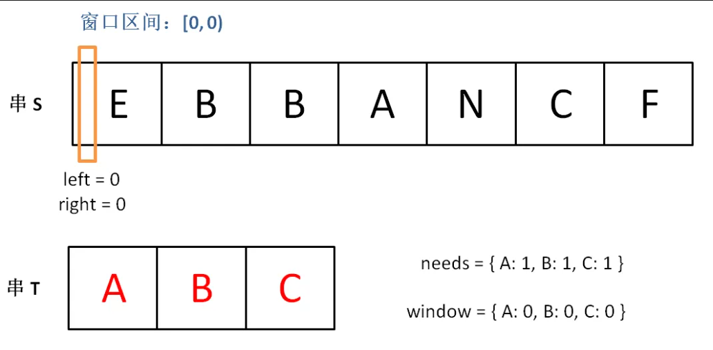
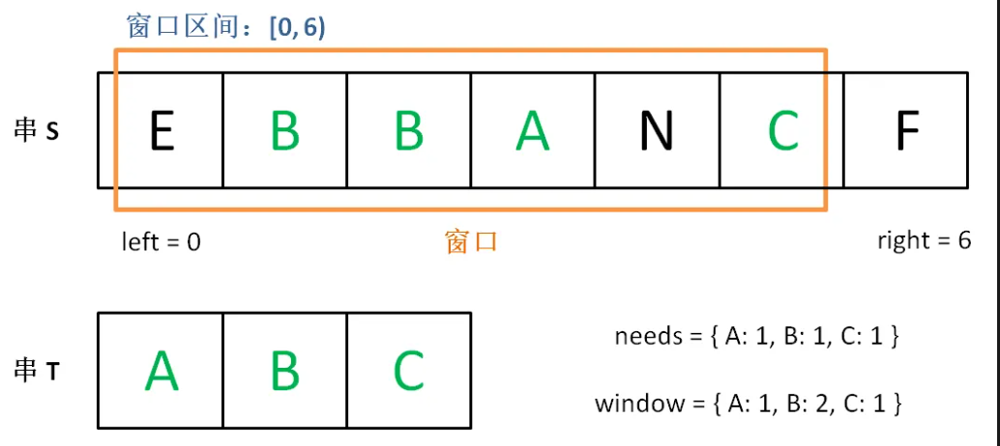
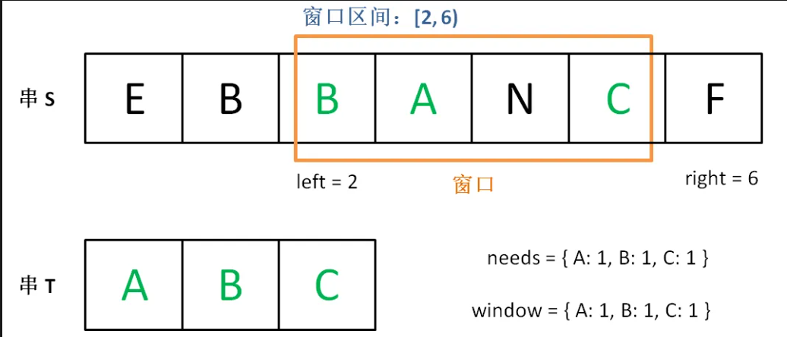
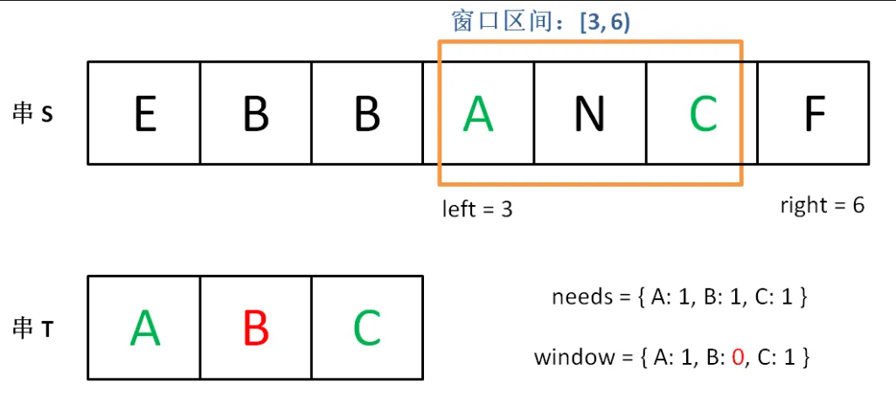

# 滑动窗口优化记录

## 例题
>567. 字符串的排列
>438. 找到字符串中所有字母异位词

以567题目为例，给定两个字符串s1和s2，判断s2是否包含s1的排列。换句话说，s1的排列之一是s2的子串。
>* 1. 直接暴力法，遍历s2的所有长度为s1的子串，判断是否是s1的排列。
>* 2. 滑动窗口法，使用两个哈希表分别记录s1和s2中当前窗口的字符频率，比较两个哈希表是否相等。
>* 3. 优化滑动窗口法，使用一个哈希表记录s1的字符频率，另一个哈希表记录s2中当前窗口的字符频率，并使用一个计数器记录当前窗口中有多少个字符的频率与s1相同。

## 我的思路
>我的思路：1.我看到排列组合，我就想到回溯法，回溯法的时间复杂度是O(n!)，我写题目的时候没有考虑时间复杂度。

>正确思路：valid定义当前窗口中多少个字符与s1中出现的频率相等，收缩和扩张窗口，更新valid的值和哈希表的值，最后判断valid是否等于s1中不同字符的数量。
## 需要改进点
>* **排列组合<=>无序，无序就会想到是集合**，实际是两个集合的比较，而这里字符可能重复，所以数据结构使用哈希表来记录字符频率。
>* 写算法的时候要自己去计算时间复杂度，不能只看题目难度。
>* 集合的比较
>* 
## 代码的一步步优化
```c++
// 第一版：（1）遍历s2中的所有字符，每次遍历的大小为s1.size()（2）与s1的字符频率进行比较，如果相同则返回true，否则继续遍历。
// 复杂度：O(n1*n2)
bool mycode(string s1, string s2){
    unordered_map<char, int> map1;
    for(auto i:s1){
        map1[i]++;
    }
    int n1 = s1.size();
    int n2 = s2.size();
    for(int i = 0; i<n2-n1+1; i++){
        unordered_map<char, int> map2;
        // 统计s2中当前窗口的字符频率
        for (int j = i;j<i+n1;j++){
            map2[s2[j]]++;
        }
        // 两个集合的比较
        int valid = 0;
        for(auto it = s1.begin();it!=s1.end();it++){
            if(map2.find(*it)==map2.end()||map1[*it]!=map2[*it]){
                break;
            }
            // 统计当前窗口中有多少个字符的频率与s1相同
            valid++;
        }
        if(valid==n1)
            return true;
    }
    return false;
}
```
按照上述的思路，写438，会报超出时间限制的错误，（ai写：原因是438题目中s2的长度可能达到10^5，而我的算法是O(n1*n2)，所以需要优化）。

```c++
// 第二版: 优化窗口的统计，因为每次窗口移动时，只会有一个字符进入窗口，一个字符离开窗口，所以不需要每次都重新统计整个窗口的字符频率，而是只需要更新进入和离开的字符的频率即可。
// 复杂度：O(n1*n2)
bool checkInclusion(string s1, string s2) {
    unordered_map<char, int> map1;
    for(auto i:s1){
        map1[i]++;
    }
    int n1 = s1.size();
    int n2 = s2.size();
    unordered_map<char, int> map2;
    for(int i = 0; i<n2-n1+1; i++){
        if(i==0){
            for (int j = i;j<i+n1;j++){
                map2[s2[j]]++;
            }
        }
        else{
            map2[s2[i+n1-1]]++;
            map2[s2[i-1]]--;
        }
        int valid = 0;
        int f_cnt = 0;
        for(auto it = s1.begin();it!=s1.end();it++){
            if(map2.find(*it)==map2.end()||map1[*it]!=map2[*it]){
                break;
            }
            valid++;
        }
        if(valid==n1)
            return true;
    }
    return false;
}
````

```c++
// 第三版：将四种情况的判断条件进行优化，合并为两种情况：进入窗口的字符频率与s1相同，离开窗口的字符频率与s1相同，计数器不变；否则计数器加一或减一。为什么可以这样优化呢？因为当进入窗口的字符频率与s1相同，离开窗口的字符频率与s1相同，计数器不变，这种情况已经包含在了其他三种情况中，所以可以将四种情况合并为两种情况。复杂度：O(n1+n2)
bool checkInclusion(string s1, string s2) {
    int n1 = s1.size();
    int n2 = s2.size();
    if (n1 > n2) return false;
    unordered_map<char, int> map1;
    unordered_map<char, int> map2;

    for(auto i:s1){
        map1[i]++;
    }
    int target = map1.size();
    int valid = 0;
    for(int i = 0; i<n2; i++){
        map2[s2[i]]++;
        if(map2.find(s2[i])!=map2.end()&&map1[s2[i]]==map2[s2[i]])
            valid++;
        if (i-n1>=0){
            map2[s2[i-n1]]--;
            if(map2.find(s2[i-n1])!=map2.end()&&map1[s2[i-n1]]-1==map2[s2[i-n1]])
                valid--;
        }
        if(valid==target)
            return true;
    }
    return false;
}
```

> 集合的比较：第一版的集合比较是有问题的：
* **两个集合的比较，为什么要引入第三方 s1 ?**
* **valid的定义是什么，为什么要和n1比较**（没有搞清楚valid的定义就写代码了），valid的定义是**当前窗口中有多少个字符的频率与s1相同**，n1是s1的长度，valid的定义是错误的，因为s1中可能有重复的字符，所以valid的定义应该是当前窗口中有多少个字符的频率与s1相同，而不是当前窗口中有多少个字符与s1相同。
* 到了第三版，valid的定义才是正确的，为什么要和target_num比较，因为target_num是s1中不同字符的数量，当valid等于target_num时，说明当前窗口中有多少个字符的频率与s1相同。

很神奇的是 第一版居然通过了?

```c++
//两个集合的比较，改正后
int valid = 0;
        for(auto it = map1.begin();it!=map1.end();it++){
            if(map2.find(it->first)==map2.end()||map1[it->first]!=map2[it->first]){
                break;
            }
            // 统计当前窗口中满足条件的字符的频率
            valid++;
        }
        if(valid==map1.size())
            return true;
```

## 滑动算法模板
https://mp.weixin.qq.com/s/ioKXTMZufDECBUwRRp3zaA
```c++
/* 滑动窗口算法框架 */
void slidingWindow(string s, string t) {
    unordered_map<char, int> need, window;
    for (char c : t) need[c]++;

    int left = 0, right = 0;
    int valid = 0; 
    while (right < s.size()) {
        // c 是将移入窗口的字符
        char c = s[right];
        // 右移窗口
        right++;
        // 进行窗口内数据的一系列更新
        ...

        /*** debug 输出的位置 ***/
        printf("window: [%d, %d)\n", left, right);
        /********************/

        // 判断左侧窗口是否要收缩
        while (window needs shrink) {
            // d 是将移出窗口的字符
            char d = s[left];
            // 左移窗口
            left++;
            // 进行窗口内数据的一系列更新
            ...
        }
    }
}
```
```c++
// 判断 s 中是否存在 t 的排列
bool checkInclusion(string t, string s) {
    unordered_map<char, int> need, window;
    for (char c : t) need[c]++;

    int left = 0, right = 0;
    int valid = 0;
    while (right < s.size()) {
        char c = s[right];
        right++;
        // 进行窗口内数据的一系列更新
        if (need.count(c)) {
            window[c]++;
            if (window[c] == need[c])
                valid++;
        }

        // 判断左侧窗口是否要收缩
        while (right - left >= t.size()) {
            // 在这里判断是否找到了合法的子串
            if (valid == need.size())
                return true;
            char d = s[left];
            left++;
            // 进行窗口内数据的一系列更新
            if (need.count(d)) {
                if (window[d] == need[d])
                    valid--;
                window[d]--;
            }
        }
    }
    // 未找到符合条件的子串
    return false;
}
```
```c++
// 自己写的，且在leetcode上通过
bool mycode2(string s1, string s2){
    int l = 0, r= 0;
    int n1 = s1.size();
    int n2 = s2.size();
    unordered_map<char,int> map1;
    for(auto c:s1){
        map1[c]++;
    }
    unordered_map<char,int> map2;
    int valid = 0;
    while(r<n2){
        map2[s2[r]]++;
        if(map1.find(s2[r])!=map1.end() && map2[s2[r]]==map1[s2[r]]){
            valid++;
        }
        while(r-l>=n1){
            if(map1.find(s2[l])!=map1.end() && map2[s2[l]]==map1[s2[l]])
                valid--;
            map2[s2[l]]--;
            l++;
        }
        if(valid==map1.size())
            return true;
        r++;
    }
    return false;
}
```
***
**以下是自己的思考和公众号的分割线**
***

## 公众号可参考(以下内容为labuladong公众号原文，可参考)
原文链接：https://mp.weixin.qq.com/s/ioKXTMZufDECBUwRRp3zaA

LeetCode 上有起码 10 道运用滑动窗口算法的题目，难度都是中等和困难。该算法的大致逻辑如下：

```c++
int left = 0, right = 0;
while (right < s.size()) {
    // 增大窗口
    window.add(s[right]);
    right++;

    while (window needs shrink) {
        // 缩小窗口
        window.remove(s[left]);
        left++;
    }
}
```
这个算法技巧的时间复杂度是 O(N)，比一般的字符串暴力算法要高效得多。

其实困扰大家的，不是算法的思路，而是各种细节问题。比如说如何向窗口中添加新元素，如何缩小窗口，在窗口滑动的哪个阶段更新结果。即便你明白了这些细节，也容易出 bug，找 bug 还不知道怎么找，真的挺让人心烦的。

所以今天我就写一套滑动窗口算法的代码框架，我连在哪里做输出 debug 都给你写好了，以后遇到相关的问题，你就默写出来如下框架然后改三个地方就行，还不会出边界问题：
```c++
/* 滑动窗口算法框架 */
void slidingWindow(string s, string t) {
    unordered_map<char, int> need, window;
    for (char c : t) need[c]++;

    int left = 0, right = 0;
    int valid = 0; 
    while (right < s.size()) {
        // c 是将移入窗口的字符
        char c = s[right];
        // 右移窗口
        right++;
        // 进行窗口内数据的一系列更新
        ...

        /*** debug 输出的位置 ***/
        printf("window: [%d, %d)\n", left, right);
        /********************/

        // 判断左侧窗口是否要收缩
        while (window needs shrink) {
            // d 是将移出窗口的字符
            char d = s[left];
            // 左移窗口
            left++;
            // 进行窗口内数据的一系列更新
            ...
        }
    }
}
```
其中两处...表示的更新窗口数据的地方，到时候你直接往里面填就行了。

而且，这两个...处的操作分别是右移和左移窗口更新操作，等会你会发现它们操作是完全对称的。

说句题外话，其实有很多人喜欢执着于表象，不喜欢探求问题的本质。比如说有很多人评论我这个框架，说什么散列表速度慢，不如用数组代替散列表；还有很多人喜欢把代码写得特别短小，说我这样代码太多余，影响编译速度，LeetCode 上速度不够快。

我也是服了，算法看的是时间复杂度，你能确保自己的时间复杂度最优就行了。至于 LeetCode 所谓的运行速度，那个都是玄学，只要不是慢的离谱就没啥问题，根本不值得你从编译层面优化，不要舍本逐末……

labuladong 公众号的重点在于算法思想，你把框架思维了然于心套出解法，然后随你再魔改代码好吧，你高兴就好。

言归正传，下面就直接上四道 LeetCode 原题来套这个框架，其中第一道题会详细说明其原理，后面四道就直接闭眼睛秒杀了。

本文代码为 C++ 实现，不会用到什么编程方面的奇技淫巧，但是还是简单介绍一下一些用到的数据结构，以免有的读者因为语言的细节问题阻碍对算法思想的理解：

>unordered_map就是哈希表（字典），它的一个方法count(key)相当于 Java 的containsKey(key)可以判断键 key 是否存在。可以使用方括号访问键对应的值map[key]。需要注意的是，如果该key不存在，C++ 会自动创建这个 key，并把map[key]赋值为 0。所以代码中多次出现的map[key]++相当于 Java 的map.put(key, map.getOrDefault(key, 0) + 1)。

### 一、最小覆盖子串
LeetCode 76 题，Minimum Window Substring，难度 Hard，我带大家看看它到底有多 Hard：
就是说要在S(source) 中找到包含T(target) 中全部字母的一个子串，且这个子串一定是所有可能子串中最短的。
如果我们使用暴力解法，代码大概是这样的：
```c++
for (int i = 0; i < s.size(); i++)
    for (int j = i + 1; j < s.size(); j++)
        if s[i:j] 包含 t 的所有字母:
            更新答案
```
思路很直接，但是显然，这个算法的复杂度肯定大于 O(N^2) 了，不好。

滑动窗口算法的思路是这样：

1、我们在字符串S中使用双指针中的左右指针技巧，初始化left = right = 0，把索引左闭右开区间[left, right)称为一个「窗口」。

2、我们先不断地增加right指针扩大窗口[left, right)，直到窗口中的字符串符合要求（包含了T中的所有字符）。

3、此时，我们停止增加right，转而不断增加left指针缩小窗口[left, right)，直到窗口中的字符串不再符合要求（不包含T中的所有字符了）。同时，每次增加left，我们都要更新一轮结果。

4、重复第 2 和第 3 步，直到right到达字符串S的尽头。

这个思路其实也不难，第 2 步相当于在寻找一个「可行解」，然后第 3 步在优化这个「可行解」，最终找到最优解，也就是最短的覆盖子串。左右指针轮流前进，窗口大小增增减减，窗口不断向右滑动，这就是「滑动窗口」这个名字的来历。

下面画图理解一下，needs和window相当于计数器，分别记录T中字符出现次数和「窗口」中的相应字符的出现次数。

初始状态：


增加right，直到窗口[left, right)包含了T中所有字符：


现在开始增加left，缩小窗口[left, right)。


直到窗口中的字符串不再符合要求，left不再继续移动。

之后重复上述过程，先移动right，再移动left…… 直到right指针到达字符串S的末端，算法结束。

如果你能够理解上述过程，恭喜，你已经完全掌握了滑动窗口算法思想。现在我们来看看这个滑动窗口代码框架怎么用：

首先，初始化**window**和**need**两个哈希表，记录窗口中的字符和需要凑齐的字符：
```c++
unordered_map<char, int> need, window;
for (char c : t) need[c]++;
```
然后，使用left和right变量初始化窗口的两端，不要忘了，区间[left, right)是左闭右开的，所以初始情况下窗口没有包含任何元素：
```c++
int left = 0, right = 0;
int valid = 0; 
while (right < s.size()) {
    // 开始滑动
}
```
其中valid变量表示窗口中满足need条件的字符个数，如果valid和need.size的大小相同，则说明窗口已满足条件，已经完全覆盖了串T。

现在开始套模板，只需要思考以下四个问题：

1、当移动right扩大窗口，即加入字符时，应该更新哪些数据？

2、什么条件下，窗口应该暂停扩大，开始移动left缩小窗口？

3、当移动left缩小窗口，即移出字符时，应该更新哪些数据？

4、我们要的结果应该在扩大窗口时还是缩小窗口时进行更新？

如果一个字符进入窗口，应该增加window计数器；如果一个字符将移出窗口的时候，应该减少window计数器；当valid满足need时应该收缩窗口；应该在收缩窗口的时候更新最终结果。

下面是完整代码：
```c++
string minWindow(string s, string t) {
    unordered_map<char, int> need, window;
    for (char c : t) need[c]++;

    int left = 0, right = 0;
    int valid = 0;
    // 记录最小覆盖子串的起始索引及长度
    int start = 0, len = INT_MAX;
    while (right < s.size()) {
        // c 是将移入窗口的字符
        char c = s[right];
        // 右移窗口
        right++;
        // 进行窗口内数据的一系列更新
        if (need.count(c)) {
            window[c]++;
            if (window[c] == need[c])
                valid++;
        }

        // 判断左侧窗口是否要收缩
        while (valid == need.size()) {
            // 在这里更新最小覆盖子串
            if (right - left < len) {
                start = left;
                len = right - left;
            }
            // d 是将移出窗口的字符
            char d = s[left];
            // 左移窗口
            left++;
            // 进行窗口内数据的一系列更新
            if (need.count(d)) {
                if (window[d] == need[d])
                    valid--;
                window[d]--;
            }                    
        }
    }
    // 返回最小覆盖子串
    return len == INT_MAX ?
        "" : s.substr(start, len);
}
```
需要注意的是，当我们发现某个字符在window的数量满足了need的需要，就要更新valid，表示有一个字符已经满足要求。而且，你能发现，两次对窗口内数据的更新操作是完全对称的。

当valid == need.size()时，说明T中所有字符已经被覆盖，已经得到一个可行的覆盖子串，现在应该开始收缩窗口了，以便得到「最小覆盖子串」。

移动left收缩窗口时，窗口内的字符都是可行解，所以应该在收缩窗口的阶段进行最小覆盖子串的更新，以便从可行解中找到长度最短的最终结果。

至此，应该可以完全理解这套框架了，滑动窗口算法又不难，就是细节问题让人烦得很。以后遇到滑动窗口算法，你就按照这框架写代码，保准没有 bug，还省事儿。

下面就直接利用这套框架秒杀几道题吧，你基本上一眼就能看出思路了。

### 二、字符串排列
LeetCode 567 题，Permutation in String，难度 Medium：

这种题目，是明显的滑动窗口算法，相当给你一个S和一个T，请问你S中是否存在一个子串，包含T中所有字符且不包含其他字符？

首先，先复制粘贴之前的算法框架代码，然后明确刚才提出的 4 个问题，即可写出这道题的答案：
```c++
// 判断 s 中是否存在 t 的排列
bool checkInclusion(string t, string s) {
    unordered_map<char, int> need, window;
    for (char c : t) need[c]++;

    int left = 0, right = 0;
    int valid = 0;
    while (right < s.size()) {
        char c = s[right];
        right++;
        // 进行窗口内数据的一系列更新
        if (need.count(c)) {
            window[c]++;
            if (window[c] == need[c])
                valid++;
        }

        // 判断左侧窗口是否要收缩
        while (right - left >= t.size()) {
            // 在这里判断是否找到了合法的子串
            if (valid == need.size())
                return true;
            char d = s[left];
            left++;
            // 进行窗口内数据的一系列更新
            if (need.count(d)) {
                if (window[d] == need[d])
                    valid--;
                window[d]--;
            }
        }
    }
    // 未找到符合条件的子串
    return false;
}
```
对于这道题的解法代码，基本上和最小覆盖子串一模一样，只需要改变两个地方：

1、本题移动left缩小窗口的时机是窗口大小大于t.size()时，因为排列嘛，显然长度应该是一样的。

2、当发现valid == need.size()时，就说明窗口中就是一个合法的排列，所以立即返回true。

至于如何处理窗口的扩大和缩小，和最小覆盖子串完全相同。

### 三、找所有字母异位词
这是 LeetCode 第 438 题，Find All Anagrams in a String，难度 Medium：

呵呵，这个所谓的字母异位词，不就是排列吗，搞个高端的说法就能糊弄人了吗？相当于，输入一个串S，一个串T，找到S中所有T的排列，返回它们的起始索引。

直接默写一下框架，明确刚才讲的 4 个问题，即可秒杀这道题：
```c++
vector<int> findAnagrams(string s, string t) {
    unordered_map<char, int> need, window;
    for (char c : t) need[c]++;

    int left = 0, right = 0;
    int valid = 0;
    vector<int> res; // 记录结果
    while (right < s.size()) {
        char c = s[right];
        right++;
        // 进行窗口内数据的一系列更新
        if (need.count(c)) {
            window[c]++;
            if (window[c] == need[c]) 
                valid++;
        }
        // 判断左侧窗口是否要收缩
        while (right - left >= t.size()) {
            // 当窗口符合条件时，把起始索引加入 res
            if (valid == need.size())
                res.push_back(left);
            char d = s[left];
            left++;
            // 进行窗口内数据的一系列更新
            if (need.count(d)) {
                if (window[d] == need[d])
                    valid--;
                window[d]--;
            }
        }
    }
    return res;
}
```
跟寻找字符串的排列一样，只是找到一个合法异位词（排列）之后将起始索引加入res即可。

### 四、最长无重复子串
这是 LeetCode 第 3 题，Longest Substring Without Repeating Characters，难度 Medium：

这个题终于有了点新意，不是一套框架就出答案，不过反而更简单了，稍微改一改框架就行了：
```c++
int lengthOfLongestSubstring(string s) {
    unordered_map<char, int> window;

    int left = 0, right = 0;
    int res = 0; // 记录结果
    while (right < s.size()) {
        char c = s[right];
        right++;
        // 进行窗口内数据的一系列更新
        window[c]++;
        // 判断左侧窗口是否要收缩
        while (window[c] > 1) {
            char d = s[left];
            left++;
            // 进行窗口内数据的一系列更新
            window[d]--;
        }
        // 在这里更新答案
        res = max(res, right - left);
    }
    return res;
}
```
这就是变简单了，连need和valid都不需要，而且更新窗口内数据也只需要简单的更新计数器window即可。

当window[c]值大于 1 时，说明窗口中存在重复字符，不符合条件，就该移动left缩小窗口了嘛。

唯一需要注意的是，在哪里更新结果res呢？我们要的是最长无重复子串，哪一个阶段可以保证窗口中的字符串是没有重复的呢？

这里和之前不一样，要在收缩窗口完成后更新res，因为窗口收缩的 while 条件是存在重复元素，换句话说收缩完成后一定保证窗口中没有重复嘛。